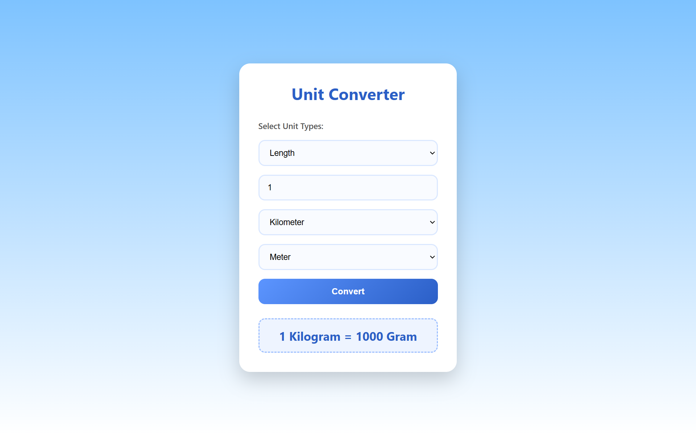

# Unit Converter

A simple web-based unit converter for converting length, weight, and temperature values.

## Features

- Convert length units
- Convert weight units
- Convert temperature units
- Dynamic unit selection
- Input validation
- Responsive interface

## Technologies

- HTML5
- CSS
- JavaScript

## Project Structure
```
.
├── index.html
├── style.css
├── script.js
├── preview.png
└── README.md
```

## Preview


